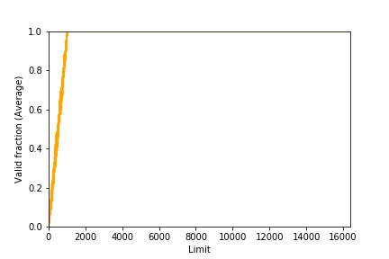

# Mechanism: Address Translation

## Homework (Simulation)

The program `relocation.py` allows you to see how address translations are performed in a system with base and bounds registers. See the README for details.

### Questions

1. Run with seeds 1, 2, and 3, and compute whether each virtual address generated by the process is in or out of bounds. If in bounds, compute the translation.

    ```
    $ ./relocation.py -s 1 -c
    $ ./relocation.py -s 2 -c
    $ ./relocation.py -s 3 -c
    ```

2. Run with these flags: `-s 0 -n 10`. What value do you have set `-l` (the bounds register) to in order to ensure that all the generated virtual addresses are within bounds?

    ```
    $ ./relocation.py -s 0 -n 10 -l 930 -c
    ```

3. Run with these flags: `-s 1 -n 10 -l 100`. What is the maximum value that base can be set to, such that the address space still fits into physical memory in its entirety?

    16 * 1024 - 100 = 16284

    ```
    $ ./relocation.py -s 1 -n 10 -l 100 -b 16284 -c
    ```

4. Run some of the same problems above, but with larger address spaces (`-a`) and physical memories (`-p`).

    1 * 1024 * 1024 * 1024 - 100 = 1073741724

    ```
    $ ./relocation.py -s 1 -n 10 -l 100 -b 1073741724 -a 32m -p 1g -c
    ```

5. What fraction of randomly-generated virtual addresses are valid, as a function of the value of the bounds register? Make a graph from running with different random seeds, with limit values ranging from 0 up to the maximum size of the address space.

    ```
    $ ./polt.py
    ```

    
