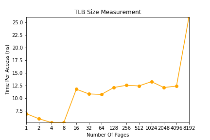

# Paging: Faster Translations (TLBs)

## Homework (Measurement)

### Questions

1. For timing, you’ll need to use a timer (e.g., `gettimeofday()`). How precise is such a timer? How long does an operation have to take in order for you to time it precisely? (this will help determine how many times, in a loop, you’ll have to repeat a page access in order to time it successfully)

    It can get the number of seconds and microseconds since the Epoch.

    One microsecond.

2. Write the program, called `tlb.c`, that can roughly measure the cost of accessing each page. Inputs to the program should be: the number of pages to touch and the number of trials.

3. Now write a script in your favorite scripting language (csh, python, etc.) to run this program, while varying the number of pages accessed from 1 up to a few thousand, perhaps incrementing by a factor of two per iteration. Run the script on different machines and gather some data. How many trials are needed to get reliable measurements?

    1 microsecond / (1 nanosecond * page number) = 1000 / 1 = 1000

4. Next, graph the results, making a graph that looks similar to the one above. Use a good tool like `ploticus` or even `zplot`. Visualization usually makes the data much easier to digest; why do you think that is?

    

5. One thing to watch out for is compiler optimization. Compilers do all sorts of clever things, including removing loops which increment values that no other part of the program subsequently uses. How can you ensure the compiler does not remove the main loop above from your TLB size estimator?

    Using gcc's optimize option `gcc -O0` to disable optimization. This is the default setting.

6. Another thing to watch out for is the fact that most systems today ship with multiple CPUs, and each CPU, of course, has its own TLB hierarchy. To really get good measurements, you have to run your code on just one CPU, instead of letting the scheduler bounce it from one CPU to the next. How can you do that? (hint: look up “pinning a thread” on Google for some clues) What will happen if you don’t do this, and the code moves from one CPU to the other?

    `sched_setaffinity()`

7. Another issue that might arise relates to initialization. If you don’t initialize the array a above before accessing it, the first time you access it will be very expensive, due to initial access costs such as demand zeroing. Will this affect your code and its timing? What can you do to counterbalance these potential costs?

    `calloc()`
