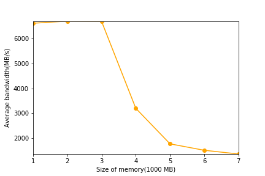

# Beyond Physical Memory: Mechanisms

## Homework (Measurement)

This homework introduces you to a new tool, **vmstat**, and how it can be used to understand memory, CPU, and I/O usage. Read the associated README and examine the code in `mem.c` before proceeding to the exercises and questions below.

### Questions

1. First, open two separate terminal connections to the same machine, so that you can easily run something in one window and the other.

    Now,in one window, run `vmstat 1`, which shows statistics about machine usage every second. Read the man page, the associated README, and any other information you need so that you can understand its output. Leave this window running `vmstat` for the rest of the exercises below.

    Now, we will run the program `mem.c` but with very little memory usage. This can be accomplished by typing `./mem 1` (which uses only 1 MB of memory). How do the CPU usage statistics change when running `mem`? Do the numbers in the `user time` column make sense? How does this change when running more than one instance of `mem` at once?

    The user time increase and the idle time decrease. Yes.

    Run `./mem 1 & ./mem 1 &`, the user time doubled.

2. Let’s now start looking at some of the memory statistics while running `mem`. We’ll focus on two columns: `swpd` (the amount of virtual memory used) and `free`(the amount of idle memory). Run `./mem 1024` (which allocates 1024 MB) and watch how these values change. Then kill the running program (by typing control-c) and watch again how the values change. What do you notice about the values? In particular, how does the `free` column change when the program exits? Does the amount of free memory increase by the expected amount when `mem` exits?

    The `free` column increase when the program start to run then decrease when program exits. Yes.

3. We’ll next look at the `swap` columns(`si` and `so`), which indicate how much swapping is taking place to and from the disk. Of course, to activate these, you’ll need to run `mem` with large amounts of memory. First, examine how much free memory is on your Linux system (for example, by typing `cat /proc/meminfo`; type `man proc` for details on the `/proc` filesystem and the types of information you can find there). One of the first entries in `/proc/meminfo` is the total amount of memory in your system. Let’s assume it’s something like 8GB of memory; if so, start by running `mem 4000`(about 4 GB) and watching the swap in/out columns. Do they ever give non-zero values? Then, try with `5000, 6000`, etc. What happens to these values as the program enters the second loop (and beyond), as compared to the first loop? How much data (total) are swapped in and out during the second, third, and subsequent loops? (do the numbers make sense?)

    Yes. The amount of memory swapped to disk increase in first loop, then become zero.

4. Do the same experiments as above, but now watch the other statistics(such as CPU utilization, and block I/O statistics). How do they change when `mem` is running?

    User time and blocks sent to a block device both increase.

5. Now let’s examine performance. Pick an input for `mem` that comfortably fits in memory (say `4000` if the amount of memory on the system is 8 GB). How long does loop 0 take (and subsequent loops 1, 2, etc.)? Now pick a size comfortably beyond the size of memory (say `12000` again assuming 8 GB of memory). How long do the loops take here? How do the bandwidth numbers compare? How different is performance when constantly swapping versus fitting everything comfortably in memory? Can you make a graph, with the size of memory used by `mem` on the x-axis, and the bandwidth of accessing said memory on the y-axis? Finally, how does the performance of the first loop compare to that of subsequent loops, for both the case where everything fits in memory and where it doesn’t?

    ```
    allocating 4194304000 bytes (4000.00 MB)
    number of integers in array: 1048576000
    loop 0 in 2431.52 ms (bandwidth: 1645.06 MB/s)
    loop 1 in 1491.87 ms (bandwidth: 2681.19 MB/s)
    loop 2 in 803.59 ms (bandwidth: 4977.65 MB/s)
    loop 3 in 856.26 ms (bandwidth: 4671.47 MB/s)
    loop 4 in 703.96 ms (bandwidth: 5682.15 MB/s)
    loop 5 in 645.71 ms (bandwidth: 6194.71 MB/s)
    loop 6 in 683.58 ms (bandwidth: 5851.58 MB/s)
    loop 7 in 855.74 ms (bandwidth: 4674.33 MB/s)
    loop 8 in 686.36 ms (bandwidth: 5827.87 MB/s)
    loop 9 in 644.70 ms (bandwidth: 6204.39 MB/s)

    allocating 8388608000 bytes (8000.00 MB)
    number of integers in array: 2097152000
    loop 0 in 5754.12 ms (bandwidth: 1390.31 MB/s)
    loop 1 in 6780.24 ms (bandwidth: 1179.90 MB/s)
    loop 2 in 6397.43 ms (bandwidth: 1250.50 MB/s)
    loop 3 in 6538.60 ms (bandwidth: 1223.50 MB/s)
    loop 4 in 6942.04 ms (bandwidth: 1152.40 MB/s)
    loop 5 in 6667.59 ms (bandwidth: 1199.83 MB/s)
    loop 6 in 6631.68 ms (bandwidth: 1206.33 MB/s)
    loop 7 in 7509.63 ms (bandwidth: 1065.30 MB/s)
    loop 8 in 6221.05 ms (bandwidth: 1285.96 MB/s)
    loop 9 in 6507.70 ms (bandwidth: 1229.31 MB/s)
    ```

    

    

6. Swap space isn’t infinite. You can use the tool `swapon` with the `-s` flag to see how much swap space is available. What happens if you try to run `mem` with increasingly large values, beyond what seems to be available in swap? At what point does the memory allocation fail?

    90% of total memory plus total swap.

7. Finally, if you’re advanced, you can configure your system to use different swap devices using `swapon` and `swapoff`. Read the man pages for details. If you have access to different hardware, see how the performance of swapping changes when swapping to a classic hard drive, a flash-based SSD, and even a RAID array. How much can swapping performance be improved via newer devices? How close can you get to in-memory performance?
