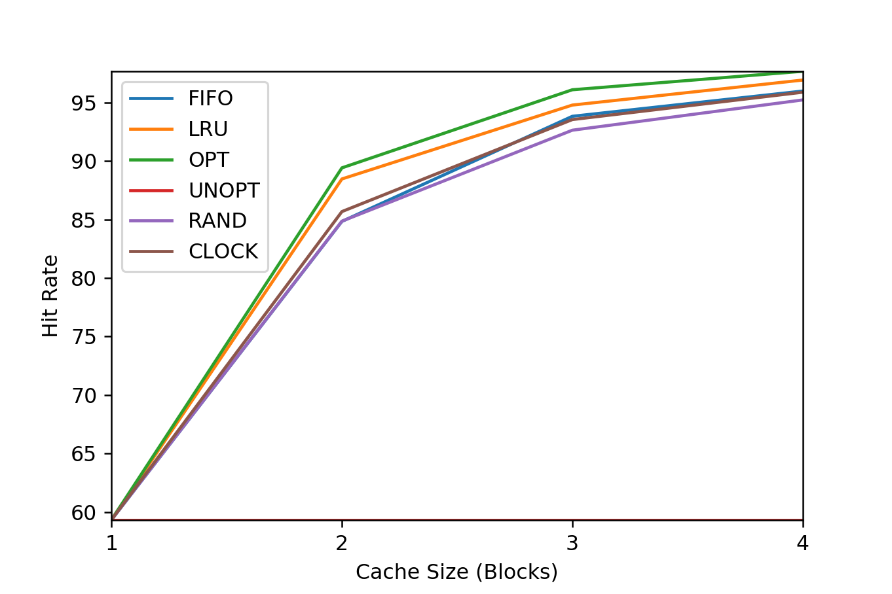

# Homework (Simulation)

This simulator, `paging-policy.py`, allows you to play around with different page-replacement policies. See the README for details.

## Questions

1. Generate random addresses with the following arguments: `-s 0 -n 10`, `-s 1 -n 10`, and `-s 2 -n 10`. Change the policy from FIFO, to LRU, to OPT. Compute whether each access in said address traces are hits or misses.

    ```
    ./paging-policy.py -s 0 -n 10 -c
    ./paging-policy.py -s 0 -n 10 -c --policy=LRU
    ./paging-policy.py -s 0 -n 10 -c --policy=OPT
    ```

2. For a cache of size 5, generate worst-case address reference streams for each of the following policies: FIFO, LRU, and MRU (worst-case reference streams cause the most misses possible). For the worst case reference streams, how much bigger of a cache is needed to improve performance dramatically and approach OPT?

    ```
    ./paging-policy.py --addresses=0,1,2,3,4,5,0,1,2,3,4,5 --policy=FIFO --cachesize=5 -c
    ./paging-policy.py --addresses=0,1,2,3,4,5,0,1,2,3,4,5 --policy=LRU --cachesize=5 -c
    ./paging-policy.py --addresses=0,1,2,3,4,5,4,5,4,5,4,5 --policy=MRU --cachesize=5 -c
    ```

    One.

3. Generate a random trace (use python or perl). How would you expect the different policies to perform on such a trace?

    ```
    ./paging-policy.py -s 0 -n 10 -c
    FINALSTATS hits 1   misses 9   hitrate 10.00

    ./paging-policy.py -s 0 -n 10 -c --policy=LRU
    FINALSTATS hits 2   misses 8   hitrate 20.00

    ./paging-policy.py -s 0 -n 10 -c --policy=OPT
    FINALSTATS hits 4   misses 6   hitrate 40.00

    ./paging-policy.py -s 0 -n 10 -c --policy=UNOPT
    FINALSTATS hits 0   misses 10   hitrate 0.00

    ./paging-policy.py -s 0 -n 10 -c --policy=RAND
    FINALSTATS hits 0   misses 10   hitrate 0.00

    ./paging-policy.py -s 0 -n 10 -c --policy=CLOCK
    FINALSTATS hits 1   misses 9   hitrate 10.00
    ```

4. Now generate a trace with some locality. How can you generate such a trace? How does LRU perform on it? How much better than RAND is LRU? How does CLOCK do? How about CLOCK with different numbers of clock bits?

    ```
    $ ./generate-trace.py
    [3, 0, 6, 6, 6, 6, 7, 0, 6, 6]

    $ ./paging-policy.py --addresses=3,0,6,6,6,6,7,0,6,6 --policy=LRU -c
    FINALSTATS hits 6   misses 4   hitrate 60.00

    $ ./paging-policy.py --addresses=3,0,6,6,6,6,7,0,6,6 --policy=RAND -c
    FINALSTATS hits 5   misses 5   hitrate 50.00

    $ ./paging-policy.py --addresses=3,0,6,6,6,6,7,0,6,6 --policy=CLOCK -c -b 2
    Access: 3  MISS Left  ->          [3] <- Right Replaced:- [Hits:0 Misses:1]
    Access: 0  MISS Left  ->       [3, 0] <- Right Replaced:- [Hits:0 Misses:2]
    Access: 6  MISS Left  ->    [3, 0, 6] <- Right Replaced:- [Hits:0 Misses:3]
    Access: 6  HIT  Left  ->    [3, 0, 6] <- Right Replaced:- [Hits:1 Misses:3]
    Access: 6  HIT  Left  ->    [3, 0, 6] <- Right Replaced:- [Hits:2 Misses:3]
    Access: 6  HIT  Left  ->    [3, 0, 6] <- Right Replaced:- [Hits:3 Misses:3]
    Access: 7  MISS Left  ->    [3, 6, 7] <- Right Replaced:0 [Hits:3 Misses:4]
    Access: 0  MISS Left  ->    [3, 7, 0] <- Right Replaced:6 [Hits:3 Misses:5]
    Access: 6  MISS Left  ->    [7, 0, 6] <- Right Replaced:3 [Hits:3 Misses:6]
    Access: 6  HIT  Left  ->    [7, 0, 6] <- Right Replaced:- [Hits:4 Misses:6]
    FINALSTATS hits 4   misses 6   hitrate 40.00

    $ ./paging-policy.py --addresses=3,0,6,6,6,6,7,0,6,6 --policy=CLOCK -c -b 0
    Access: 3  MISS Left  ->          [3] <- Right Replaced:- [Hits:0 Misses:1]
    Access: 0  MISS Left  ->       [3, 0] <- Right Replaced:- [Hits:0 Misses:2]
    Access: 6  MISS Left  ->    [3, 0, 6] <- Right Replaced:- [Hits:0 Misses:3]
    Access: 6  HIT  Left  ->    [3, 0, 6] <- Right Replaced:- [Hits:1 Misses:3]
    Access: 6  HIT  Left  ->    [3, 0, 6] <- Right Replaced:- [Hits:2 Misses:3]
    Access: 6  HIT  Left  ->    [3, 0, 6] <- Right Replaced:- [Hits:3 Misses:3]
    Access: 7  MISS Left  ->    [3, 0, 7] <- Right Replaced:6 [Hits:3 Misses:4]
    Access: 0  HIT  Left  ->    [3, 0, 7] <- Right Replaced:- [Hits:4 Misses:4]
    Access: 6  MISS Left  ->    [3, 7, 6] <- Right Replaced:0 [Hits:4 Misses:5]
    Access: 6  HIT  Left  ->    [3, 7, 6] <- Right Replaced:- [Hits:5 Misses:5]
    FINALSTATS hits 5   misses 5   hitrate 50.00

    $ ./paging-policy.py --addresses=3,0,6,6,6,6,7,0,6,6 --policy=CLOCK -c -b 1
    Access: 3  MISS Left  ->          [3] <- Right Replaced:- [Hits:0 Misses:1]
    Access: 0  MISS Left  ->       [3, 0] <- Right Replaced:- [Hits:0 Misses:2]
    Access: 6  MISS Left  ->    [3, 0, 6] <- Right Replaced:- [Hits:0 Misses:3]
    Access: 6  HIT  Left  ->    [3, 0, 6] <- Right Replaced:- [Hits:1 Misses:3]
    Access: 6  HIT  Left  ->    [3, 0, 6] <- Right Replaced:- [Hits:2 Misses:3]
    Access: 6  HIT  Left  ->    [3, 0, 6] <- Right Replaced:- [Hits:3 Misses:3]
    Access: 7  MISS Left  ->    [3, 0, 7] <- Right Replaced:6 [Hits:3 Misses:4]
    Access: 0  HIT  Left  ->    [3, 0, 7] <- Right Replaced:- [Hits:4 Misses:4]
    Access: 6  MISS Left  ->    [3, 7, 6] <- Right Replaced:0 [Hits:4 Misses:5]
    Access: 6  HIT  Left  ->    [3, 7, 6] <- Right Replaced:- [Hits:5 Misses:5]
    FINALSTATS hits 5   misses 5   hitrate 50.00

    $ ./paging-policy.py --addresses=3,0,6,6,6,6,7,0,6,6 --policy=CLOCK -c -b 3
    Access: 0  MISS Left  ->       [3, 0] <- Right Replaced:- [Hits:0 Misses:2]
    Access: 6  MISS Left  ->    [3, 0, 6] <- Right Replaced:- [Hits:0 Misses:3]
    Access: 6  HIT  Left  ->    [3, 0, 6] <- Right Replaced:- [Hits:1 Misses:3]
    Access: 6  HIT  Left  ->    [3, 0, 6] <- Right Replaced:- [Hits:2 Misses:3]
    Access: 6  HIT  Left  ->    [3, 0, 6] <- Right Replaced:- [Hits:3 Misses:3]
    Access: 7  MISS Left  ->    [3, 6, 7] <- Right Replaced:0 [Hits:3 Misses:4]
    Access: 0  MISS Left  ->    [6, 7, 0] <- Right Replaced:3 [Hits:3 Misses:5]
    Access: 6  HIT  Left  ->    [6, 7, 0] <- Right Replaced:- [Hits:4 Misses:5]
    Access: 6  HIT  Left  ->    [6, 7, 0] <- Right Replaced:- [Hits:5 Misses:5]
    FINALSTATS hits 5   misses 5   hitrate 50.00
    ```

5. Use a program like `valgrind` to instrument a real application and generate a virtual page reference stream. For example, running `valgrind --tool=lackey --trace-mem=yes ls` will output a nearly-complete reference trace of every instruction and data reference made by the program `ls`. To make this useful for the simulator above, you’ll have to first transform each virtual memory reference into a virtual page-number reference (done by masking off the offset and shifting the resulting bits downward). How big of a cache is needed for your application trace in order to satisfy a large fraction of requests? Plot a graph of its working set as the size of the cache increases.

    [Specific Details about --trace-mem=yes](https://sourceware.org/git/?p=valgrind.git;a=blob;f=lackey/lk_main.c;h=1bcd8ed566edc0fdf68c2efcb797753a4fd8bb39;hb=HEAD#l55)

    ```
    $ valgrind --tool=lackey --trace-mem=yes ls &> ls-trace.txt
    // Count to 3, ^C

    $ ./transform.py    // transform to VPN
    $ ./run.sh          // get some data
    $ ./plot.py
    ```

    
