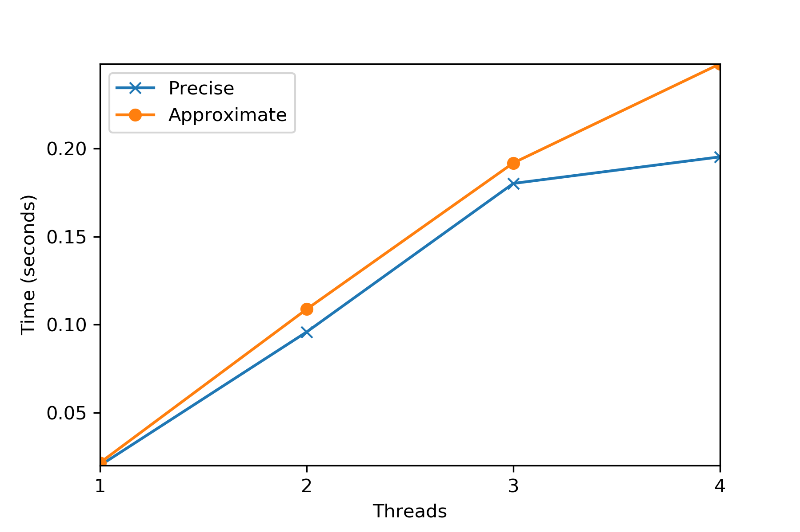
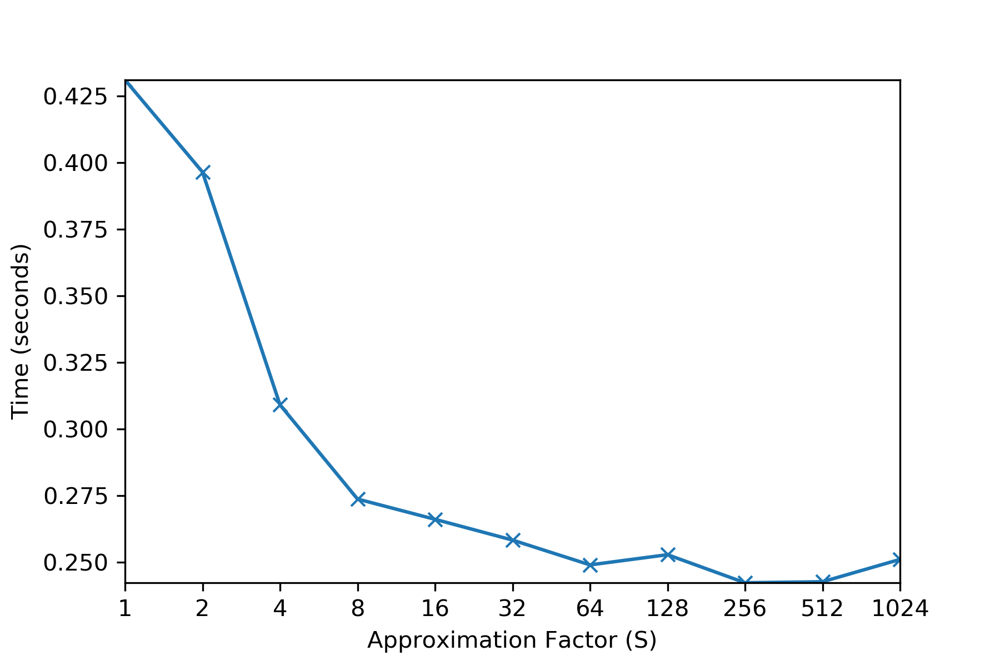

# Lock-based Concurrent Data Structures

## Homework (Code)

In this homework, you’ll gain some experience with writing concurrent code and measuring its performance. Learning to build code that performs well is a critical skill and thus gaining a little experience here with it is quite worthwhile.

### Questions

1. We’ll start by redoing the measurements within this chapter. Use the call `gettimeofday()` to measure time within your program. How accurate is this timer? What is the smallest interval it can measure? Gain confidence in its workings, as we will need it in all subsequent questions. You can also look into other timers, such as the cycle counter available on x86 via the `rdtsc` instruction.

    `gettimeofday()` can measure microseconds.

    [How to Benchmark Code Execution Times on Intel®IA-32 and IA-64 Instruction Set Architectures](https://www.intel.com/content/dam/www/public/us/en/documents/white-papers/ia-32-ia-64-benchmark-code-execution-paper.pdf)

2. Now, build a simple concurrent counter and measure how long it takes to increment the counter many times as the number of threads increases. How many CPUs are available on the system you are using? Does this number impact your measurements at all?

    Four cores(eight threads) on mac, two cores(four threads) on FreeBSD. More cores actually runs more slowly(see FreeBSD results).

    [Hyper-threading](https://en.wikipedia.org/wiki/Hyper-threading)

    ```
    $ hwloc-ls
    // check CPU numbers
    $ nproc
    // Linux
    $ cat /proc/cpuinfo
    // FreeBSD, macOS
    $ sysctl hw.ncpu
    // macOS
    $ sysctl hw.physicalcpu
    ```

    Or

    ```c
    #include <stdio.h>
    #include <unistd.h>

    int main(int argc, char *argv[]) {
        // logical CPUs
        printf("Number of logical CPUs: %ld", sysconf(_SC_NPROCESSORS_ONLN));
        return 0;
    }
    ```

    Here are my results. The time of one thread is close to the book(0.03 seconds), but the results of more threads from the book are all exceed five seconds.

    

    Approximate: approximate counters with threshold 1024.

    ```
    // Runs on 2.3 GHz Quad-Core Intel i5-8259U, macOS 10.15.5
    // remove cpu limitation code(_np nonportable)
    $ ./simple_counter.out
    1 threads
    global count: 1000000
    Time (seconds): 0.019966

    2 threads
    global count: 2000000
    Time (seconds): 0.095837

    3 threads
    global count: 3000000
    Time (seconds): 0.180244

    4 threads
    global count: 4000000
    Time (seconds): 0.195340
    ```

```
// Runs on 1.7 GHz Dual-Core Intel i5-4210U, FreeBSD 12.1
$ ./simple_counter.out
1 cpus, 1 threads
global count: 1000000
Time (seconds): 0.051862

1 cpus, 2 threads
global count: 2000000
Time (seconds): 0.101337

1 cpus, 3 threads
global count: 3000000
Time (seconds): 0.150807

1 cpus, 4 threads
global count: 4000000
Time (seconds): 0.197938

2 cpus, 1 threads
global count: 1000000
Time (seconds): 0.051836

2 cpus, 2 threads
global count: 2000000
Time (seconds): 0.268700

2 cpus, 3 threads
global count: 3000000
Time (seconds): 0.428179

2 cpus, 4 threads
global count: 4000000
Time (seconds): 0.537222

3 cpus, 1 threads
global count: 1000000
Time (seconds): 0.051874

3 cpus, 2 threads
global count: 2000000
Time (seconds): 0.288678

3 cpus, 3 threads
global count: 3000000
Time (seconds): 0.390897

3 cpus, 4 threads
global count: 4000000
Time (seconds): 0.457693

4 cpus, 1 threads
global count: 1000000
Time (seconds): 0.051800

4 cpus, 2 threads
global count: 2000000
Time (seconds): 0.267941

4 cpus, 3 threads
global count: 3000000
Time (seconds): 0.390828

4 cpus, 4 threads
global count: 4000000
Time (seconds): 0.575514
```

3. Next, build a version of the sloppy counter. Once again, measure its performance as the number of threads varies, as well as the threshold. Do the numbers match what you see in the chapter?

    The time of four threads, one threshold in the book is more then ten seconds.

    

```
$ make && ./approximate_counter.out
// Runs on 2.3 GHz Quad-Core Intel i5-8259U, macOS 10.15.5
1 threads, 1 threshold
1000000 global counter
Time (seconds): 0.039374

2 threads, 1 threshold
2000000 global counter
Time (seconds): 0.154999

3 threads, 1 threshold
3000000 global counter
Time (seconds): 0.290122

4 threads, 1 threshold
4000000 global counter
Time (seconds): 0.430974

1 threads, 2 threshold
1000000 global counter
Time (seconds): 0.029924

2 threads, 2 threshold
2000000 global counter
Time (seconds): 0.160152

3 threads, 2 threshold
3000000 global counter
Time (seconds): 0.239309

4 threads, 2 threshold
4000000 global counter
Time (seconds): 0.396419

1 threads, 4 threshold
1000000 global counter
Time (seconds): 0.037816

2 threads, 4 threshold
2000000 global counter
Time (seconds): 0.128155

3 threads, 4 threshold
3000000 global counter
Time (seconds): 0.217316

4 threads, 4 threshold
4000000 global counter
Time (seconds): 0.309085

1 threads, 8 threshold
1000000 global counter
Time (seconds): 0.023351

2 threads, 8 threshold
2000000 global counter
Time (seconds): 0.125174

3 threads, 8 threshold
3000000 global counter
Time (seconds): 0.204623

4 threads, 8 threshold
4000000 global counter
Time (seconds): 0.273745

1 threads, 16 threshold
1000000 global counter
Time (seconds): 0.022184

2 threads, 16 threshold
2000000 global counter
Time (seconds): 0.122244

3 threads, 16 threshold
3000000 global counter
Time (seconds): 0.201845

4 threads, 16 threshold
4000000 global counter
Time (seconds): 0.266137

1 threads, 32 threshold
1000000 global counter
Time (seconds): 0.021799

2 threads, 32 threshold
2000000 global counter
Time (seconds): 0.113584

3 threads, 32 threshold
3000000 global counter
Time (seconds): 0.195953

4 threads, 32 threshold
4000000 global counter
Time (seconds): 0.258349

1 threads, 64 threshold
1000000 global counter
Time (seconds): 0.021402

2 threads, 64 threshold
2000000 global counter
Time (seconds): 0.114720

3 threads, 64 threshold
3000000 global counter
Time (seconds): 0.196661

4 threads, 64 threshold
4000000 global counter
Time (seconds): 0.249036

1 threads, 128 threshold
999936 global counter
Time (seconds): 0.021340

2 threads, 128 threshold
2000000 global counter
Time (seconds): 0.101197

3 threads, 128 threshold
2999936 global counter
Time (seconds): 0.195355

4 threads, 128 threshold
4000000 global counter
Time (seconds): 0.252860

1 threads, 256 threshold
999936 global counter
Time (seconds): 0.021262

2 threads, 256 threshold
1999872 global counter
Time (seconds): 0.109795

3 threads, 256 threshold
2999808 global counter
Time (seconds): 0.198884

4 threads, 256 threshold
4000000 global counter
Time (seconds): 0.242337

1 threads, 512 threshold
999936 global counter
Time (seconds): 0.021172

2 threads, 512 threshold
1999872 global counter
Time (seconds): 0.103475

3 threads, 512 threshold
2999808 global counter
Time (seconds): 0.195022

4 threads, 512 threshold
3999744 global counter
Time (seconds): 0.242711

1 threads, 1024 threshold
999424 global counter
Time (seconds): 0.022284

2 threads, 1024 threshold
1999872 global counter
Time (seconds): 0.112219

3 threads, 1024 threshold
2999296 global counter
Time (seconds): 0.191190

4 threads, 1024 threshold
3999744 global counter
Time (seconds): 0.251097
```

4. Build a version of a linked list that uses hand-over-hand locking[[MS04](https://www.cs.tau.ac.il/~shanir/concurrent-data-structures.pdf)], as cited in the chapter. You should read the paper first to understand how it works, and then implement it. Measure its performance. When does a hand-over-hand list work better than a standard list as shown in the chapter?

    Never?

5. Pick your favorite interesting data structure, such as a B-tree or other slightly more interested structure. Implement it, and start with a simple locking strategy such as a single lock. Measure its performance as the number of concurrent threads increases.

    Translated from [algs4 BTree](https://github.com/kevin-wayne/algs4/blob/master/src/main/java/edu/princeton/cs/algs4/BTree.java)

    ```
    $ make && ./btree.out
    1 threads, time (seconds): 0.000223
    size: 100

    2 threads, time (seconds): 0.000202
    size: 100

    3 threads, time (seconds): 0.000234
    size: 99

    4 threads, time (seconds): 0.000251
    size: 100

    5 threads, time (seconds): 0.000242
    size: 100

    6 threads, time (seconds): 0.000317
    size: 96

    7 threads, time (seconds): 0.000294
    size: 98

    8 threads, time (seconds): 0.000320
    size: 96

    9 threads, time (seconds): 0.000295
    size: 99

    10 threads, time (seconds): 0.000342
    size: 100
    ```
