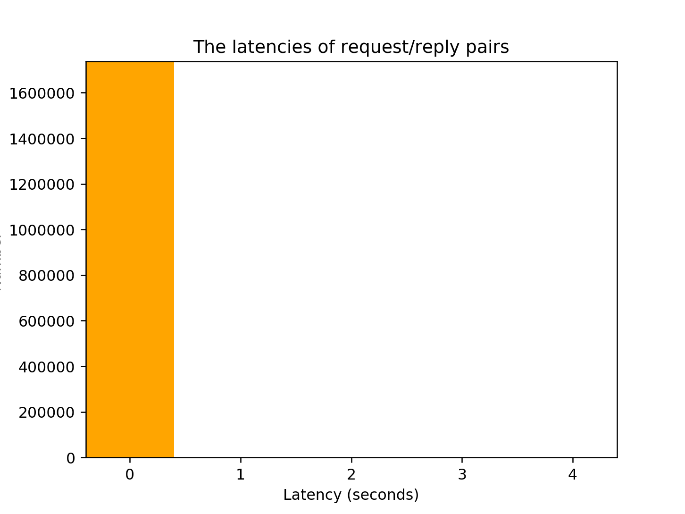

# Sun’s Network File System (NFS)

## Homework (Measurement)

In this homework, you’ll do a little bit of NFS trace analysis using real traces. The source of these traces is Ellard and Seltzer’s effort [ES03]. Make sure to read the related README and download the relevant tarball from the OSTEP homework page (as usual) before starting.

### Questions

1. A first question for your trace analysis: using the timestamps found in the first column, determine the period of time the traces were taken from. How long is the period? What day/week/month/year was it? (does this match the hint given in the filename?) Hint: Use the tools `head -1` and `tail -1` to extract the first and last lines of the file, and do the calculation.

   [`strftime()`](https://www.gnu.org/software/gawk/manual/html_node/Time-Functions.html) is `gawk` extension, it's not specified in the POSIX standard. The filename is `anon-deasna-021016-1300.txt`, that's the same date.

    ```
    $ awk -f q1.awk anon-deasna-021016-1300.txt
    Period: 59.98 minutes
    Start time: 16 10 2002
    ```

2. Now, let’s do some operation counts. How many of each type of operation occur in the trace? Sort these by frequency; which operation is most frequent? Does NFS live up to its reputation?

    ```
    $ awk '{ a[$8]++} END {for (n in a) print a[n], n}' anon-deasna-021016-1300.txt | sort -nk1 -r
    1610395 getattr
    1043752 read
    619819 write
    131453 lookup
    27699 access
    19485 setattr
    11640 remove
    9924 create
    9135 fsstat
    4290 link
    2297 readdirp
    1321 fsinfo
    918 readdir
    501 rename
    439 readlink
    187 pathconf
    136 symlink
    36 mkdir
    14 rmdir
    4 mknod

    $ awk '{ if ($5 == "C3" && ($8 == "read" || $8 == "write")) print $2, $8, $10, $12, $14 }' anon-deasna-021016-1300.txt | sort -u | wc -l
    469427

    $ awk '{ if ($5 == "C3" && ($8 == "read" || $8 == "write")) print $0 }' anon-deasna-021016-1300.txt | wc -l
    838995
    ```

    1 - 469427/838995 = 44.05% read and write commands are retry commands.

3. Now let’s look at some particular operations in more detail. For example, the GETATTR request returns a lot of information about files, including which user ID the request is being performed for, the size of the file, and so forth. Make a distribution of file sizes accessed within the trace; what is the average file size? Also, how many different users access files in the trace? Do a few users dominate traffic, or is it more spread out? What other interesting information is found within GETATTR replies?

    [Nondecimal-numbers (The GNU Awk User’s Guide)](https://www.gnu.org/software/gawk/manual/html_node/Nondecimal_002dnumbers.html)

    ```
    $ awk -f q3.awk anon-deasna-021016-1300.txt | sort -nk4 -r
    Average file size: 1682687 bytes
    Client 31.0320 requests 398535
    Client 40.03fe requests 224554
    Client 33.03fe requests 66200
    Client 45.0320 requests 14626
    Client 32.03ff requests 12915
    Client 37.03ff requests 11632
    ...
    Client 33.03ef requests 1
    136 clients
    ```

    See chapter 2 of the [NFS Version 3 Protocol Specification](https://tools.ietf.org/html/rfc1813).

4. You can also look at requests to a given file and determine how files are being accessed. For example, is a given file being read or written sequentially? Or randomly? Look at the details of READ and WRITE requests/replies to compute the answer.

    ```
    $ awk '{ if (($8 == "read" || $8 == "write") && $10 == "01122f009ead0d0120000000003669c1928f10016486000001122f009ead0d00" && $2 == "32.03fe") print $0}' sample

    $ awk '{ if (($8 == "read" || $8 == "write") && $10 == "01122f009ead0d0120000000003669d1c8a510016486000001122f009ead0d00" && $2 == "32.03ff") print $0}' sample
    
    $ awk '{ if (($8 == "read" || $8 == "write") && $10 == "01122f009ead0d01200000000087cd59588111016486000001122f009ead0d00" && $2 == "32.03fa") print $0}' sample
    ```

    Write is sequential, but read seems not.

5. Traffic comes from many machines and goes to one server (in this trace). Compute a traffic matrix, which shows how many different clients there are in the trace, and how many requests/replies go to each. Do a few machines dominate, or is it more evenly balanced?

    ```
    $ awk -f q5.awk anon-deasna-021016-1300.txt | sort -nk4 -r
    Client 32.03ff requests 568181 replies 566186
    Client 31.0320 requests 436586 replies 434361
    Client 40.03fe requests 239866 replies 238238
    Client 32.03fe requests 112251 replies 111517
    Client 33.03fe requests 81760 replies 81166
    ...
    Client 32.03ca requests 1 replies 1
    219 clients
    ```

    Only five clients have more than ten thousands requests and replies.

6. The timing information, and the per-request/reply unique ID,should allow you to compute the latency for a given request. Compute the latencies of all request/reply pairs, and plot them as a distribution. What is the average? Maximum? Minimum?

    ```
    $ !awk -f q6.awk anon-deasna-021016-1300.txt | sort -n | uniq -c | python3 ./plot.py
    ```

    

7. Sometimes requests are retried, as the request or its reply could be lost or dropped. Can you find any evidence of such retrying in the trace sample?

    See the answer of question two.

8. There are many other questions you could answer through more analysis. What questions do you think are important? Suggest them to us, and perhaps we’ll add them here!

    Find attr cache time.
