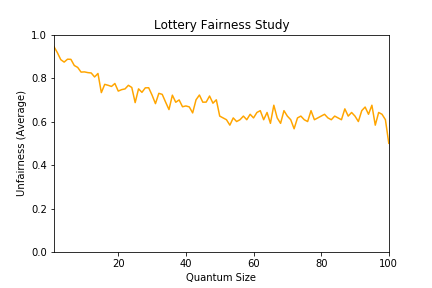
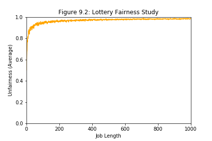
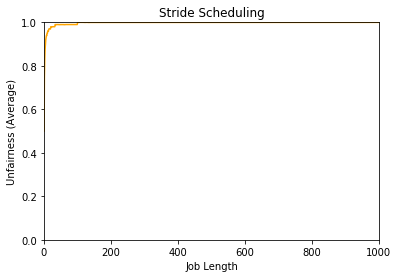

# Scheduling: Proportional Share

## Homework (Simulation)

This program, `lottery.py`, allows you to see how a lottery scheduler works. See the README for details.

### Questions

1. Compute the solutions for simulations with 3 jobs and random seeds of 1, 2, and 3.

    ```
    $ ./lottery.py -s 1 -j 3 -c
    $ ./lottery.py -s 2 -j 3 -c
    $ ./lottery.py -s 3 -j 3 -c
    ```

2. Now run with two specific jobs: each of length 10, but one (job 0) with just 1 ticket and the other (job 1) with 100 (e.g., `-l 10:1,10:100`). What happens when the number of tickets is so imbalanced? Will job 0 ever run before job 1 completes? How often? In general, what does such a ticket imbalance do to the behavior of lottery scheduling?

    ```
    $ ./lottery.py -l 10:1,10:100 -c
    ``` 

    Job 1 will have more opportunities to run.

    1/100

    Not fair for the lower tickets jobs.

3. When running with two jobs of length 100 and equal ticket allocations of 100 (`-l 100:100,100:100`), how unfair is the scheduler? Run with some different random seeds to determine the (probabilistic) answer; let unfairness be determined by how much earlier one job finishes than the other.

    ```
    $ ./lottery.py -s 0 -l 100:100,100:100 -c
    U = 192/200 = 0.96

    $ ./lottery.py -s 1 -l 100:100,100:100 -c
    U = 192/200 = 0.96

    $ ./lottery.py -s 2 -l 100:100,100:100 -c
    U = 190/200 = 0.95

    $ ./lottery.py -s 3 -l 100:100,100:100 -c
    U = 196/200 = 0.98
    ```

4. How does your answer to the previous question change as the quantum size (`-q`) gets larger?

    Lesser quantum size is fairer.

    ```
    $ ./plot_quantum.py
    ```

    

5. Can you make a version of the graph that is found in the chapter? What else would be worth exploring? How would the graph look with a stride scheduler?

    ```
    $ ./plot.py
    ```

    

    Check turnaround time.

    ```
    $ ./plot_stride.py
    ```

    
